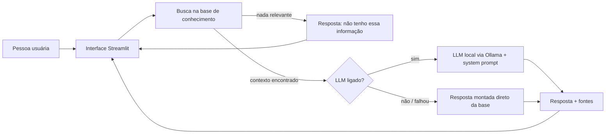

# 1. Documentação do Agente

## Caso de uso
**Problema:** quem está começando em tecnologia se perde entre dezenas de áreas, cursos e conselhos contraditórios, e acaba desistindo ou estudando sem direção.

**Solução:** o **Guia Tech** é um assistente que conversa com a pessoa, entende o que ela gosta de fazer e apresenta trilhas de estudo iniciais (Front-end, Back-end com Python, Análise de Dados, QA e fundamentos de Git/GitHub), sempre sugerindo um próximo passo concreto.

**Público-alvo:** pessoas iniciantes ou em transição de carreira que querem entrar na área de tecnologia.

## Persona e tom de voz
- Mentor(a) acolhedor(a), direto(a) e motivador(a).
- Linguagem simples, sem jargão desnecessário, em português do Brasil.
- Respostas curtas (até 8 linhas), terminando com **um** próximo passo.
- Nunca promete emprego, salário ou resultado garantido.

## Arquitetura

| Camada | Tecnologia |
|---|---|
| Interface | Streamlit |
| Recuperação | Busca por palavras-chave com pontuação (Python puro) |
| LLM (opcional) | Ollama (modelo local, ex.: `llama3.2`) |
| Base de conhecimento | JSON em `data/` |

## Segurança e anti-alucinação
1. **Só responde com contexto recuperado:** se a busca não encontra nada relevante, o LLM nem é chamado e a resposta é "não tenho essa informação".
2. **System prompt restritivo:** proíbe inventar trilhas, links, salários e prazos.
3. **Fontes exibidas:** cada resposta mostra de qual trecho da base ela veio.
4. **Sem promessas:** o prompt proíbe garantir emprego ou salário.
5. **Escopo fechado:** assuntos fora de estudos/carreira iniciante em tecnologia são recusados.
6. **Fallback offline:** se o LLM falhar, o assistente ainda responde a partir da base.

## Limitações conhecidas
- A busca é lexical (palavras-chave): perguntas com sinônimos raros podem não ser encontradas.
- A base é pequena (5 trilhas e 6 perguntas frequentes) e precisa de revisão periódica (links e prazos mudam).
- Os prazos são estimativas e variam conforme a dedicação da pessoa.
